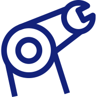

# KirigiriSuzumiya's Toolkit server

> An easy-to-built toolkit overlay server contained various open-sourced tools

- [Remote File Storage](http://110.42.255.139:9080)
- [Remote Display Protocol](http://110.42.255.139:5000)
- [Online document filling and signing](http://110.42.255.139:3000)

[GitHub](https://github.com/KirigiriSuzumiya/overlay_server_config)
[Get Started](#🤗-welcome-to-kirigirisuzumiya39s-toolkit-server)